# 🤖 Visualize RAG Data

A Retrieval-Augmented Generation (RAG) demo using [LangChain](https://github.com/langchain-ai/langchain) and [Streamlit](https://github.com/streamlit/streamlit).

## Hackathon Details
Ce projet a été réalisé dans le cadre d'un hackathon organisé par l'Université Paris Dauphine - Tunis, avec pour thème « Intelligence Artificielle Générative (Gen AI) ». Cet événement a rassemblé des étudiants passionnés par l'IA, l'innovation technologique et le développement de solutions pratiques pour des problèmes complexes. Le hackathon s’est concentré sur l’utilisation de technologies modernes telles que LangChain et les modèles GPT d'OpenAI pour créer des outils qui améliorent la recherche et l’analyse de données.

Les participants ont eu 48 heures pour conceptualiser, développer et présenter leurs projets, tout en travaillant en équipe pour relever des défis stimulants. Ce projet, intitulé "Visualize RAG Data", démontre comment exploiter l'IA pour enrichir les processus d'analyse et de visualisation de données complexes. Réalisé par l'équipe **Turing Titans**.

## 🛠️ Installation (Windows)

1. Set up a virtual environment:
   ```shell
   python3.8 -m venv .venv
   .\.venv\Scripts\activate.bat  # CMD
   # Or: .\.venv\Scripts\activate.ps1  # PowerShell
   pip install -IU pip setuptools wheel
   ```

2. Install the package:
   ```shell
   # GPU support
   pip install renumics-rag[all]@git+https://github.com/Renumics/renumics-rag.git torch torchvision sentence-transformers accelerate
   # CPU support
   # Add --extra-index-url https://download.pytorch.org/whl/cpu
   ```

## ⚙️ Configuration

Create a `.env` file for API keys:
- OpenAI:
  ```bash
  OPENAI_API_KEY="Your OpenAI API key"
  ```
- Azure OpenAI:
  ```bash
  OPENAI_API_TYPE="azure"
  OPENAI_API_VERSION="2023-08-01-preview"
  AZURE_OPENAI_API_KEY="Your Azure OpenAI API key"
  AZURE_OPENAI_ENDPOINT="Your Azure OpenAI endpoint"
  ```

## 🚀 Usage

### Indexing Data
1. Add HTML files to `data/docs`.
2. Index documents:
   ```shell
   create-db
   ```

### Questioning
Retrieve and answer questions:
```shell
retrieve "Your question"
answer "Your question"
app  # Launch web interface
```

### Used RAGs and Their Descriptions

This project incorporates several types of Retrieval-Augmented Generation (RAG) systems to enhance data analysis and interaction:

1. **Simple RAG**:
   - Retrieves relevant documents from the indexed database.
   - Uses a question-answering pipeline to respond to queries with high precision.

2. **Multi-Modal RAG**:
   - Supports data inputs from various formats such as text, images, and HTML.
   - Integrates embeddings generated by `sentence-transformers` for enhanced understanding.

3. **Interactive RAG**:
   - Allows users to dynamically query and refine searches.
   - Features real-time feedback to improve data retrieval efficiency.

4. **Visualization RAG**:
   - Combines retrieved data with graphical outputs for better comprehension.
   - Generates charts, graphs, and heatmaps as required.

5. **Data Enrichment RAG**:
   - Integrates external APIs and sources to supplement the retrieved data.
   - Enables robust and comprehensive responses to complex queries.

6. **Agent-Based RAG**:
   - Utilizes specialized agents for tasks such as hypothesis generation and report writing.
   - Streamlines workflows by delegating subtasks to appropriate agents.

### Key Components

- `hypothesis_agent`: Génère des hypothèses pour guider l'analyse initiale.
- `process_agent`: Supervise les analyses et coordonne les interactions entre les composants.
- `visualization_agent`: Crée des visualisations interactives pour représenter les résultats de manière claire.
- `report_agent`: Rédige des rapports synthétisant les découvertes et recommandations.
- `quality_review_agent`: Assure la qualité et la cohérence des résultats générés.

### Visualizations
Explore results and visualizations interactively:
   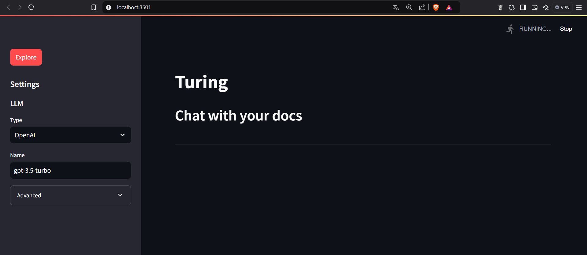
   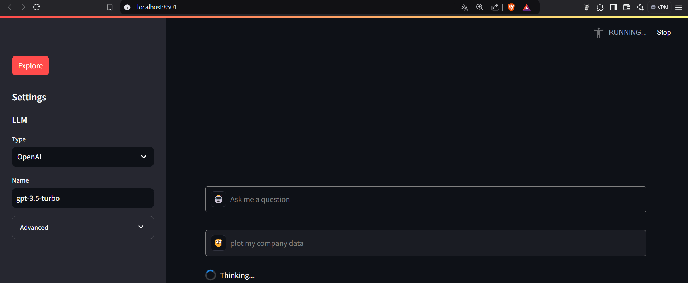
   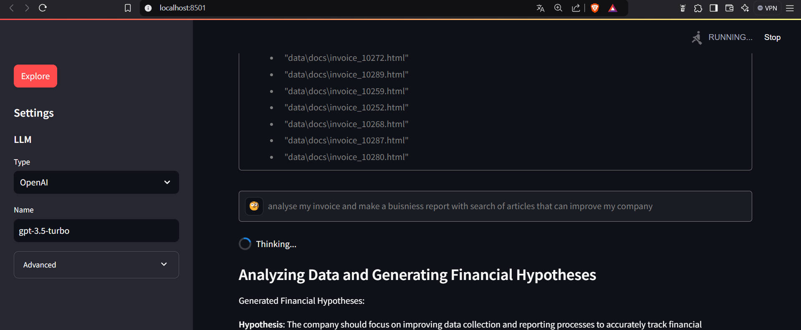
   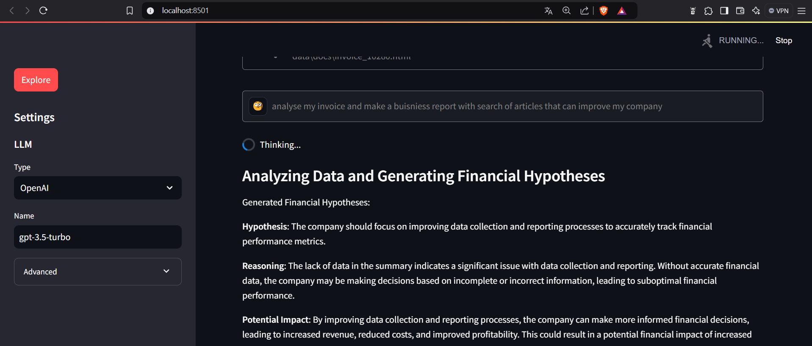
   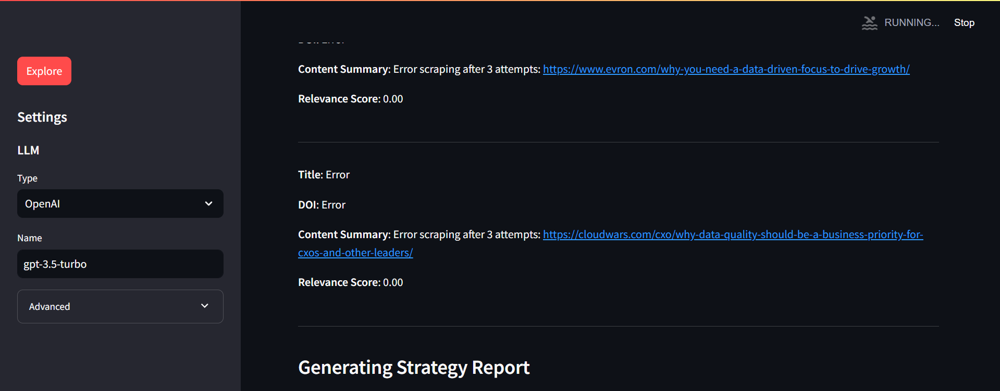
   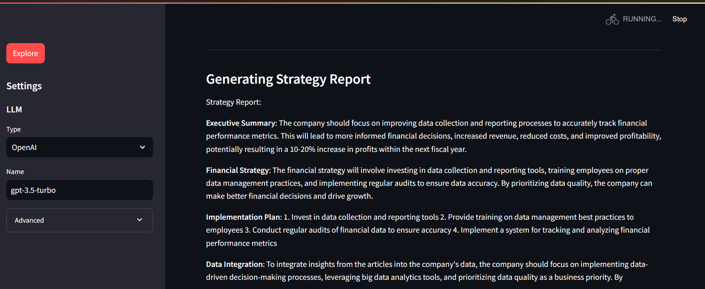
   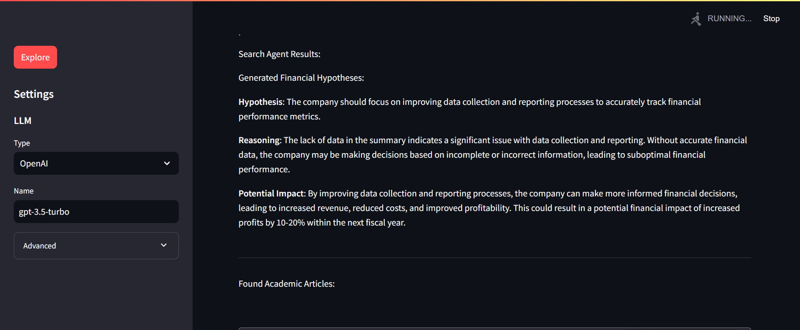
   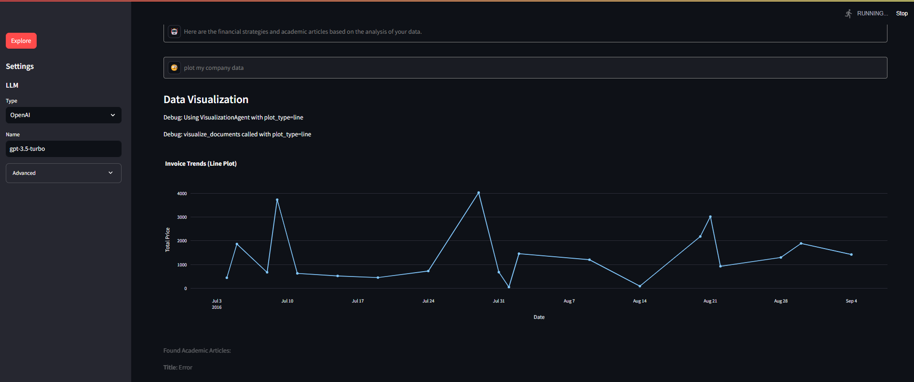
   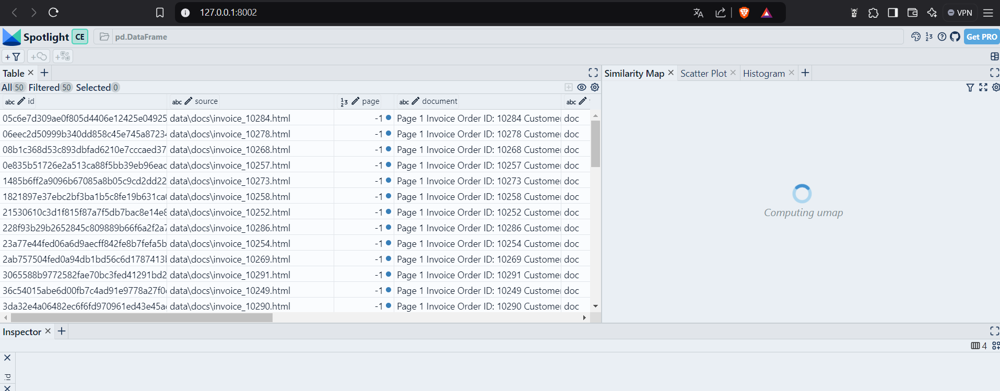
   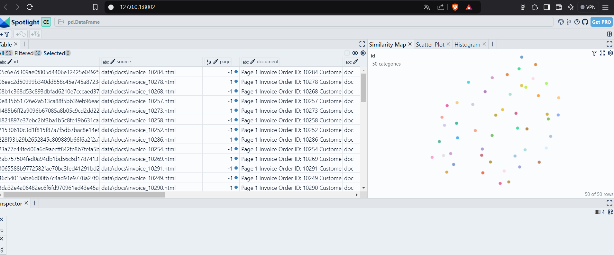
   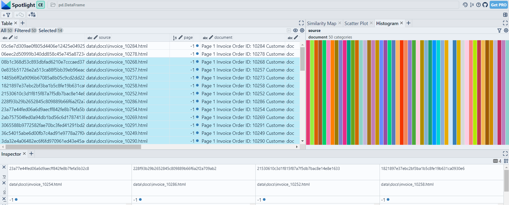

Watch the demo video:
## 🚀 Demo Video

Watch the demo video below:
<iframe width="560" height="315" src="video_2.mp4" frameborder="0" allow="accelerometer; autoplay; encrypted-media; gyroscope; picture-in-picture" allowfullscreen></iframe>


## Notes
- Assurez-vous d’avoir suffisamment de crédits OpenAI.
- Sauvegardez vos données avant utilisation.

## Contribution
Les contributions sont les bienvenues. Ouvrez une issue pour discuter des modifications.

## Licence
Ce projet est sous licence MIT. Consultez le fichier [LICENSE](LICENSE).

